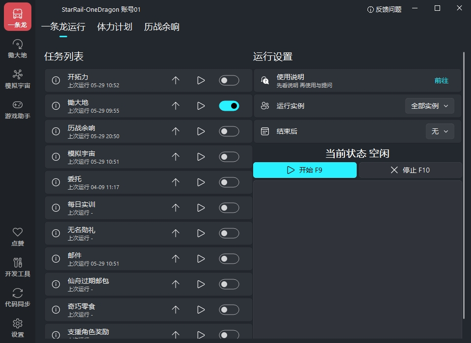

# Honkai Star Rail - One Dragon

__崩坏：星穹铁道 - 一条龙__

基于图像识别的全自动小助手，用于 Windows PC端。

如果觉得项目对你有帮助，不妨在右上角点个Star

    

        
        
    

    

        
        
    

     

## 支持功能

- **每日锄地：** 基于小地图识别坐标，支持黄泉秘技
- **模拟宇宙：** 每周100精英怪，支持第九宇宙、黄泉秘技
- **日常清理：** 刷本、领奖励、合成零食等

## 快速开始

点击这里看看[如何安装和使用吧](https://one-dragon.org/sr/zh/quickstart.html)

## 免责声明

- 本项目仅供学习交流使用。

- 开发者团队拥有本项目的最终解释权。

- 使用本项目产生的所有问题与本项目与及开发者团队无关。

- 若您遇到商家使用本软件进行代练并收费，产生的任何问题及后果与本软件无关。

## 贡献/参与者

感谢所有参与到开发的朋友们~

## 赞助

如果喜欢本项目，可以为本站点赞助点维护费用~

感谢 [小伙伴们的赞赏](https://github.com/DoctorReid/OneDragon-Thanks)

